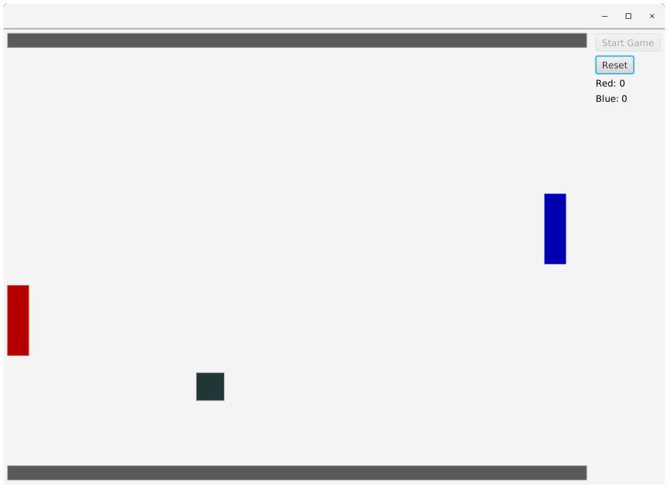

# Pong
I tried to recreate Pong. Here's the result.

## Overview and Installation

Pong is a game in which two players control two paddles on opposing sides of the board. Players attempt to reflect a continuously bouncing projectile to the opponent's side while defending their own side from receiving the projectile. The game is really simple and you've probably played this before.

Here's an image of what the game looks like when in action:

To build this game, you need a version of **Java 8**, as well as **JavaFX** for Java 8. Use `ant` to build this project from `build.xml`. If you would like an executable jar file instead, simply download `Pong.jar` and double click it to execute it.

## Controls and Rules

Use the `W` and `S` keys to move the red paddle up and down. Use the `I` and `K` keys to move the blue paddle up and down. Move the paddles to reflect the projectiles to your opponent's side. The first player to reach a score of 5 wins the game.